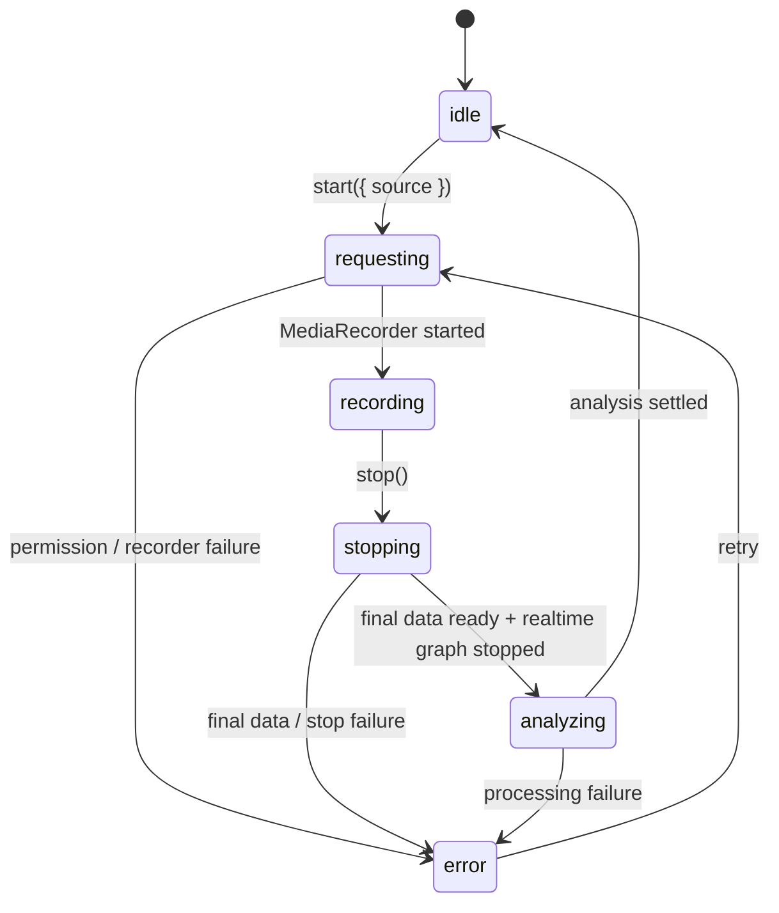

# 錄音與即時音高 session 架構

本文件定義 VPA 的錄音狀態、資源所有權與 Safari 驗證邊界。目標是讓 Quick、Professional 與 Practice 共用同一條明確的錄音 API，同時讓即時音高資源只有一個 owner。

## 狀態機



`RecordingCoordinator` 是公開錄音狀態的唯一來源。snapshot 固定包含：

- `sessionId`：單調遞增的錄音識別；舊 session 回呼不得改寫新 session。
- `source`：`quick`、`professional` 或 `practice`。
- `state`：上圖六個運作狀態加上 `error`。
- `pitchState`：`preparing`、`starting`、`active`、`sampling`、`inactive` 或 `error`。
- `error`：僅在 `error` 狀態保留。

UI 只能使用 `start({ source })`、`stop()`、`getSnapshot()` 與 `subscribe(listener)`。Quick 不得以 `#recordBtn.click()` 代理命令，也不得 polling `MediaRecorder` 狀態。

## 資源所有權

| 資源 | Owner | 停止後不變量 |
|---|---|---|
| MediaRecorder、chunks、mic stream | `recording-flow`，由 coordinator 排程 | recorder inactive、track ended、chunks 清空 |
| AudioContext | `realtime-pitch-stream` | 保留至頁面生命週期，但必須為 `suspended` |
| MediaStreamAudioSourceNode、ScriptProcessor | `realtime-pitch-stream` 的當前 session | 斷線且不再持有 handler |
| requestAnimationFrame、resize listener | `realtime-pitch-stream` 的當前 session | 取消／移除 |
| 公開 recording state | `RecordingCoordinator` | 回到 `idle` 或可重試的 `error` |
| 離線分析與評分資料 | analysis controllers | 不得由 realtime cleanup 改寫 |

保留一個 suspended AudioContext 是刻意的 reusable resource，不算 leak；processor、source、RAF、listener 或 live microphone track 在停止後仍存在才算 leak。

## 呼叫與資料流

```text
Quick / Professional / Practice click
  -> RecordingCoordinator.start({ source })
  -> recording-flow.preparePitchStream()   (同步 user gesture 階段)
  -> getUserMedia()
  -> MediaRecorder.start()
  -> realtime-pitch-stream.startPitchStream(preparation ticket)
  -> processor callback -> pitch sample -> UI values + canvas RAF

stop()
  -> MediaRecorder.stop()
  -> final data
  -> realtime graph disconnect + RAF cancel + AudioContext.suspend()
  -> offline analysis
  -> coordinator idle
```

## 即時圖表的版面不變量

錄音控制區之後必須先放 `pitchWrap` / `formantWrap`，再放播放器、進階結果與統計。`app-core` 注入既有 DOM anchor 給 player session；player UI 不得把上一輪結果插到錄音按鈕與即時圖表之間。停止錄音後隱藏即時 panels，播放器與結果自然接回控制區，不需要強制 display 或捲動補救。

2026-09-06 的 iPhone 診斷顯示第二輪 context running、callback/sample/RAF 與像素持續更新；另以 production build 重現手機版面，圖表卻被上一輪結果推到約 8,318 px 下方。診斷中的非零尺寸不等於使用者看得到。回歸測試必須檢查 viewport intersection 與 DOM 排列，不能先 `scrollIntoViewIfNeeded()` 再驗證。

## Safari user activation

瀏覽器自行發出的 MediaRecorder `stop`（包含音軌結束與錯誤）也必須先進入 `stopping`，並在分析之前釋放麥克風。錄音 chunks 屬於該次 session，不能由下一輪錄音覆寫。

停止操作會取消該 session 對 pending `resume()` 的等待，不必等瀏覽器恢復才完成清理；若舊 resume 稍後完成，只能 suspend 仍閒置且尚未被下一個 session 接手的 context。正常停止仍重用單一 suspended AudioContext。

iPhone Safari 可能要求 suspended AudioContext 的 `resume()` 發生在使用者操作的同步 call stack。若等到 `getUserMedia()` resolve 後才 resume，第二次錄音可能仍能啟動 MediaRecorder，卻沒有 realtime callback 或圖表。

因此 `prepareForUserGesture()` 必須在第一次 `await` 之前同步建立／恢復 reusable AudioContext，並回傳 preparation ticket。`startPitchStream()` 只能等待同一 ticket，不可為了繞過失敗而複製 detector 或建立另一套 canvas。

## 診斷模式

在正式 HTTPS 網址加上 `?vpaAudioDebug=1` 才會啟用音訊診斷。頁面左下會出現 JSON 下載按鈕；資料只存在有限長度的記憶體 ring buffer，不保存錄音內容、不使用 localStorage、不上傳，也不需要後端。

診斷包含 build、experience、session/source、user activation、MediaRecorder、track、AudioContext resume/suspend、processor callback、pitch sample、RAF、panel style、canvas 尺寸與取樣 checksum。

## 測試矩陣

| 層級 | 證明內容 | 不能宣稱 |
|---|---|---|
| Node unit | 狀態轉移、重入、延遲、stale session、資源清理 | 真實瀏覽器媒體 API 相容性 |
| Playwright + synthetic mic | Quick→Professional 使用者行為、panel/Hz/canvas、錯誤與 cleanup | 真實 iOS 麥克風或 AudioContext 政策 |
| Chromium fake device | 桌面原生 MediaRecorder/WebAudio 整合 | WebKit/iOS 結論 |
| iPhone Safari / Android Chrome | release build 的裝置 lifecycle | 其他未測 OS／瀏覽器版本 |

每次 lifecycle 修正必須先保存同一案例的紅燈，再讓它轉綠；發布仍以 `docs/release-device-smoke-test.md` 的實機 gate 為準。
